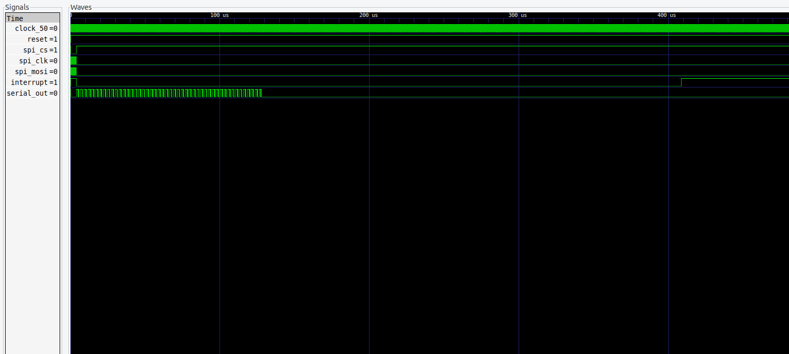

# WS2815B LED Driver

## Introduction

This is an driver for WS2815B RGB LEDs. This is used to run on a FPGA and is written in VHDL. It converts input data from a SPI interface to serial data that drives the LEDs.

## SPI Interface

TODO

## Serial output

See datasheet of WS2815B.

## Usage

To run the project you need to install following tools:
    - GHDL
    - Yosys
    - nextpnr
    - GTKWave

Synthesis:
```console
$ make build
```

Flash:
```console
$ make flash
```

Simulation:
```console
$ make sim
```

Show:
```console
$ make show
```

## Simulation



## Synthesis

TODO